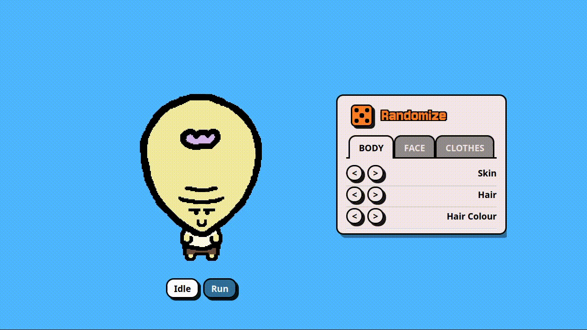

# Pixel Character Creator

A React + TypeScript character creator that renders layered pixel-art sprites on canvas, with palette-based recoloring, animated body states, and a theme-aware parallax background.

## Why I Built This

This project was built to explore performance-focused rendering techniques for browser-based pixel art applications.

The goal was to design a deterministic character configuration system, efficient canvas rendering pipeline, and reusable UI components while maintaining responsive performance in the browser.

## Live Demo

https://character-creator-orpin.vercel.app/

## Preview



## What It Does

- Builds a character from layered sprite assets for body, head, hair, eyes, and mouth
- Supports colour cycling for skin, hair, shirt, and shorts
- Switches between `idle` and `run` animation states
- Randomizes the current character and preloads the next likely asset set
- Persists the selected character to `localStorage`
- Renders a multi-layer parallax scene that only moves while the character is running
- Supports light and dark parallax themes with a crossfade transition

## Tech Stack

- React 19
- TypeScript
- Vite
- Tailwind CSS v4
- Vitest
- Testing Library

## Getting Started

```bash
npm install
npm run dev
```

Open the local Vite URL printed in the terminal.

## Available Scripts

- `npm run dev` - start the Vite dev server
- `npm run build` - run TypeScript project builds and create a production bundle
- `npm run preview` - serve the production build locally
- `npm run lint` - run ESLint
- `npm run test` - run Vitest
- `npm run test:watch` - run Vitest in watch mode
- `npm run test:coverage` - run tests with coverage output

## UI Overview

The app is split into three main areas:

- A character preview rendered on two stacked canvases so body and head layers can animate independently
- A `Run` / `Stop` control that toggles the body animation and parallax motion
- A tabbed selector with `Body`, `Face`, and `Clothes` panels for cycling character options

There is also a theme toggle in the top-left that switches the parallax palette between light and dark modes.

## How Character Rendering Works

1. Character state is provided by `CharacterConfigProvider`.
2. Asset metadata is discovered from `src/assets/character` using `import.meta.glob`.
3. `buildCharacterLayers` resolves the active config into ordered draw layers.
4. `useCharacterPreviewRenderer` runs the animation loop and draws onto body/head canvases.
5. Layered assets are rendered as background mask -> tint fill -> outline.

Current draw order:

- Body: legs -> bottom -> top -> arms
- Head: head -> eyes -> mouth -> hair

## Parallax and Themes

Parallax scene data lives in `src/data/parallax/parallaxScene.ts`.

The background system currently includes:

- Back layers for city buildings, lit windows, and ground
- A front grass layer
- Runtime tinting based on the active theme
- Width-aware tiling so layers repeat across the viewport
- Crossfading between old and new tinted layer sources when the theme changes

Parallax motion is active only when the animation state is `run`.

## State and Persistence

Character configuration is reducer-driven and stored under the localStorage key `character_config_v1`.

Saved data is clamped against currently available part IDs and palette ranges so stale local data does not break rendering after asset changes.

## Project Structure

- `src/App.tsx` - main layout, theme toggle, animation mode, and parallax composition
- `src/components` - selector UI, preview canvas, controls, and parallax presentation
- `src/data/character` - asset discovery, pairing, diagnostics, and palettes
- `src/data/parallax` - parallax scene definitions and theme palettes
- `src/hooks` - viewport measurement, floor alignment, parallax motion, tinting, and scale helpers
- `src/render/animation` - animation frame helpers
- `src/render/character` - canvas rendering, image caching, preload, and layer composition
- `src/state` - reducer, provider, selectors, and config validation
- `src/test` - test setup

## Tests

The test suite covers:

- asset discovery and pairing
- config clamping and reducer behavior
- selector utility logic
- canvas rendering and image cache behavior
- preview rendering behavior
- parallax hooks for floor alignment, motion, and tinted-source fallback
